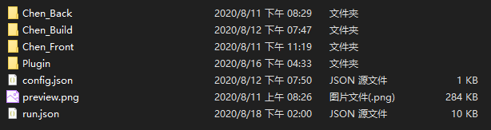

# 书写配置

# 设计说明[必看]

因为Cardinal采用了纯配置驱动方法，故配置文档的书写为制作图包的关键一步。  
Cardinal使用内定配置驱动，即任意图包必须在工作目录下书写内定配置，Cardinal读取此文件，以此获取整个图包的其他配置和资源。

# 自定义目录结构
工作目录：  

1. 保证config.json、run.json之类的配置文件始终在工作目录的根目录下。
2. 保证preview.png之类的封面图始终在工作目录根目录下
3. 其他资源放在根目录下或子目录下（只要自己认得在哪里就行）
4. 建议根据资源类型创建不同文件夹，使得目录结构条理清晰。
5. 如果需要创建插件，不建议将脚本放在根目录下直接引用，可以创建子文件夹进行引用。


# 核心配置文件
1. config.json
2. [name].json

**在参阅本章时需要有json数据格式书写基础，如果没有学习，可以参阅[菜鸟教程](https://www.runoob.com/json/json-syntax.html)**

## config.json
例子：  

```json
{
    "Name": "AICube 明日方舟 陈",
    "Description": "AICube 特别定制包",
    "cover":"preview.png",
    "Script":"run.json"
}
```

**Tip : 不要更改双引号为单引号,一切写法参照json书写规范**

### Name : 用于标识图包的名称
+ 不要使用name作为对象名称

### Description : 对图包的介绍
+ 理论是不限字数的
+ 写太多估计没人看
+ 写太少......你不写都可以
+ **切记 : 一定要把对象留着，即可以留空，但是不能删除**

### cover : 封面图片
+ 最好选择方形且背景透明的png图像
+ 封面图会被用在 : 程序显示图标、PushMsg组件提示框、设置窗口的图标、托盘栏的图标，所以请选择好的封面。