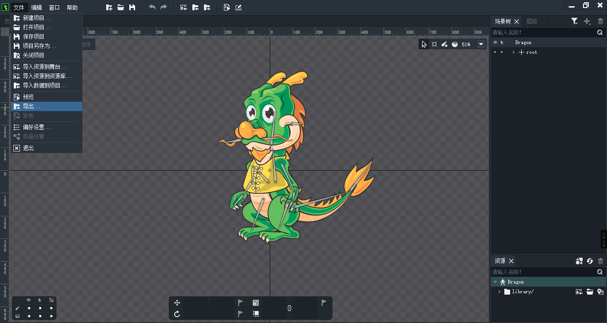
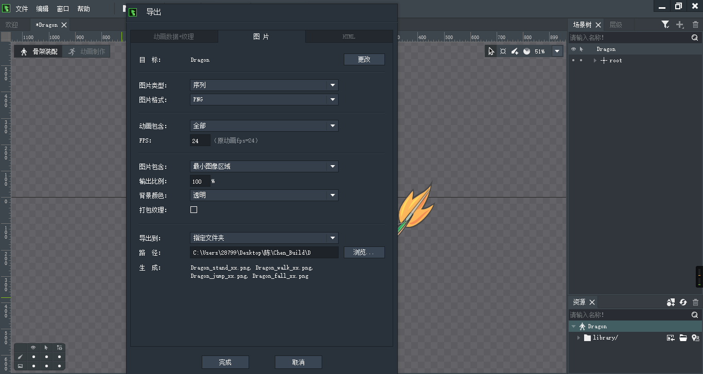
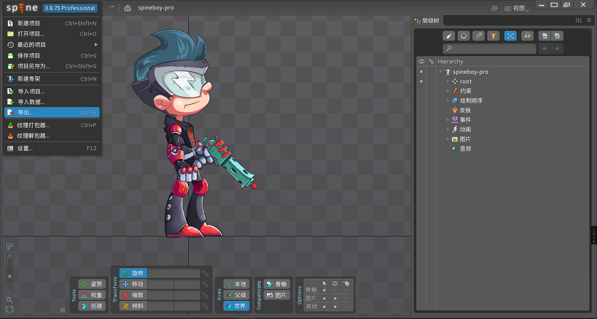
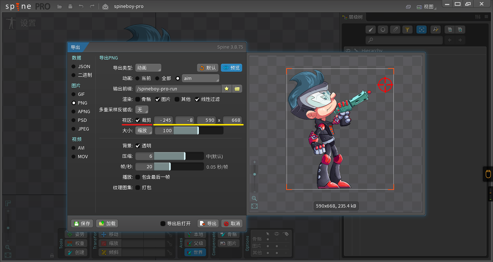
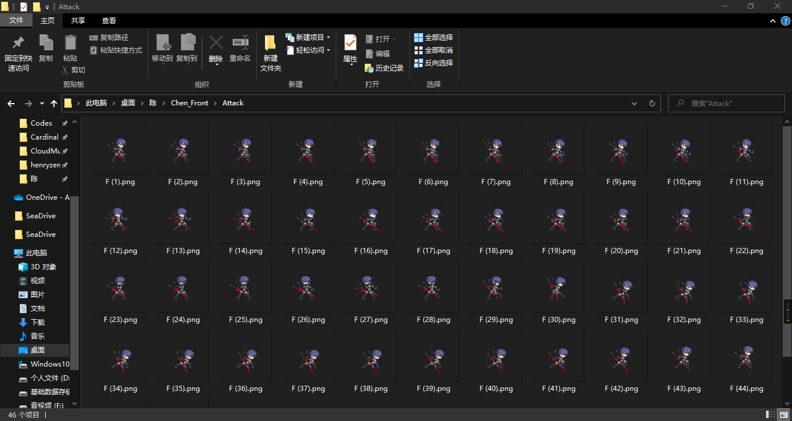

# 图包制作前期准备
## 制作工具
推荐[DragonBone](http://www.dragonbones.com)和[Spine](http://zh.esotericsoftware.com/)  
这是两款优秀的人物动画制作工具，不必二者皆用，请选择适合自己的软件。(完全可以不拘泥于这两款软件)

细节处理软件包含Photoshop、GIMP或其他你熟知的软件

## Cardinal动画播放原理
根据视觉暂留原理，使多帧序列中元素列依次显示来达到播放动画的效果。  
所以目前只支持播放帧序列(许多帧图片的有序集合)

## 制作过程
发挥你的创造力。

## 导出
这里使用[DragonBone](http://www.dragonbones.com)和[Spine](http://zh.esotericsoftware.com/)演示

### DragonBone
文件 > 导出

选择图片

根据需要进行导出，最好设置一下<图片包含>参数 自定义输出大小和起始绘制坐标，使得人物最终显示在图片正中

### Spine
Spine菜单 > 导出数据

选择png格式

点击预览，勾选<视区> 进行修改，使得人物处于图像正中央

一切准备就绪，点击导出

## 帧序列命名注意
### 要求
按照<前导字符串><无格式数字><后导字符串>的形式命名每一张图片。
例子：F(1).png

|<前导字符串>|<无格式数字>|<后导字符串>|
|-|-|-|
|F(|1|).png|

### 格式

其中 **<前导字符串>** 和 **<后导字符串>** 是不变的固定参数，即任意一个动作动画帧序列中每一张图片都需要这样的固定字段，只允许改变 **<无格式数字>** 用以标识帧。

### 说明
**<无格式数字>**是指：没有特定格式的**字符串表示数**

再举个例子：什么是**有格式字符串表示数**  
0001 0002 0003 ...... 0010  
这种具有**固定字符串宽度**的数字表示方式叫有格式字符串表示数

自然 **<无格式数字>** 就是0,1,2,3 ...... 10,11,12这种普通数字书写方法。

形如：
