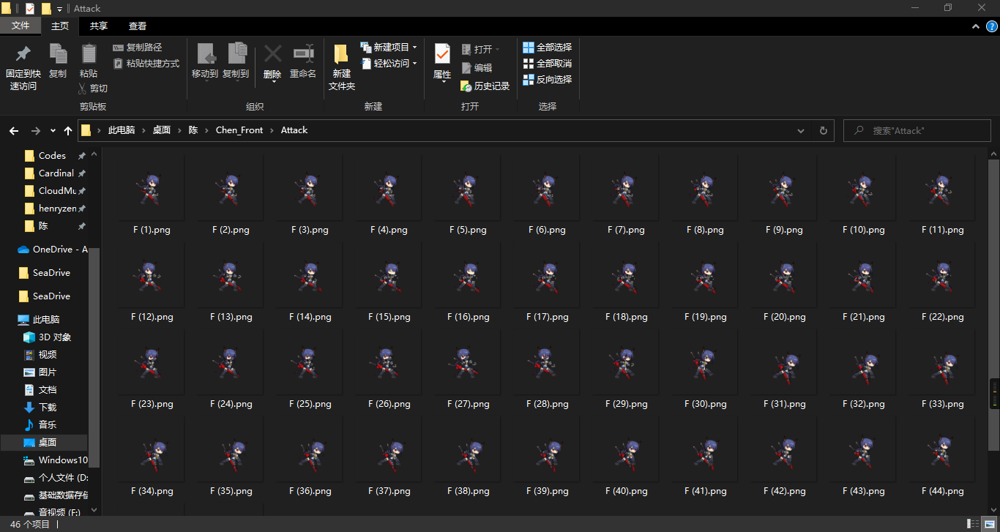

# 制作工具
我们推荐[DragonBone](http://www.dragonbones.com)和[Spine](http://zh.esotericsoftware.com/)  
这是两款优秀的人物动画制作工具，不必二者皆用，请选择适合自己的软件。(完全可以不拘泥于这两款软件)

细节处理软件包含Photoshop、GIMP或其他你熟知的软件

# Cardinal动画播放原理
根据视觉暂留原理，使多帧序列依次显示来达到播放动画的效果。  
所以目前只支持播放帧序列(许多帧图片的有序集合)

